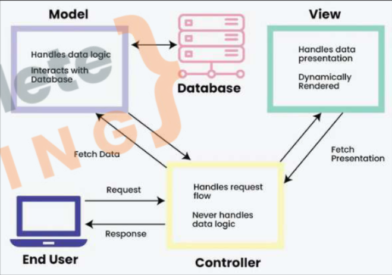

# Model View Controller

## Separation of Concerns
- **MVC stands for Model-View-Controller:** A software architectural pattern for developing user interfaces.
- **Model:** Manages the data and business logic of the application.
- **View:** Handles the display and presentation of data to the user.
- **Controller:** Processes user input, interacts with the Model, and updates the View accordingly.
- Routes are a part of Controllers.
- **Purpose:** MVC separates concerns within an application, making it easier to.


---

## How to add Controllers?
- Make a folder called controller and make your controllers there.
- eg.
- controllers/homes.js
```js
exports.getAddHome =(req, res, next)=>{
    res.render('add-home',{ pageTitle: "Add Home"})
}
const registeredHouse =[];
exports.postAddHome = (req, res, next)=>{
    registeredHouse.push(req.body);
    res.render('homeadded', { pageTitle: "Home added"})
}
```
- Update Routes:
- hostRouter.js
```js
const express = require('express');
const hostRouter = express.Router();

const { getAddHome, postAddHome } = require('../controllers/homes');

hostRouter.get("/add-home", getAddHome);

hostRouter.post("/add-home",postAddHome);

exports.hostRouter =hostRouter;
```
---

## How to Add Models?
- Make a model folder and define your models there.
- ag. home.js (model):
```js 
const registeredHouse =[];

module.exports = class Home {
    constructor(houseName, price, location, rating){
        this.houseName = houseName;
        this.price =price;
        this.location = location;
        this.rating = rating;
    }

    save() {
        registeredHouse.push(this);
    }

    static fetchAll() {
        return registeredHouse;
    }
}
```
- Nou update the controllers:
```js
const Home = require("../models/home");

exports.getAddHome =(req, res, next)=>{
    res.render('add-home',{ pageTitle: "Add Home"})
}

exports.postAddHome = (req, res, next)=>{

    const {houseName,price,location, rating} = req.body;

    const home = new Home(houseName,price,location, rating);
    home.save();

    res.render('homeadded', { pageTitle: "Home added"})
}
exports.getHome = (req, res, next)=>{
    const registeredHouse = Home.fetchAll();
    res.render('home', {registeredHouse: registeredHouse, pageTitle: "Airbnb Home"});
}
```
---

## Writing data to files
- Update your models.js
```js
const fs = require('fs');
const path = require('path');
const rootDir = require('../utils/pathUtils')


const registeredHouse =[];

module.exports = class Home {
    constructor(houseName, price, location, rating){
        this.houseName = houseName;
        this.price =price;
        this.location = location;
        this.rating = rating;
    }

    save() {
        registeredHouse.push(this);
        const homeDataPath= path.join(rootDir, 'data', 'home.json');
        fs.writeFile(homeDataPath, JSON.stringify(registeredHouse), (err)=>{
            console.log(err);
        });
    }

    static fetchAll() {
        return registeredHouse;
    }
}
```
- all the data will saved in home.json in data folder.
---
## Read The Data from files
