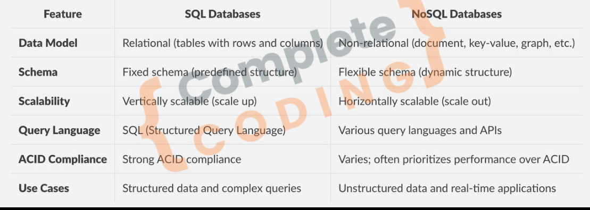

# Introduction to SQL

### What is DataBase?
1. Store Data
2. Enable Data Management
3. Falicitate Quick Access
4. Ensure Data Integrity
5. Multi User Support
6. Secure Data

---

### What is SQL?
- SQL stands for Structured Query Language.
- Here Data is stores in structure.
- Data is organized into table with row & Columns.
- Predefiend structure.
- **vertical Scalability**
- Tables can have multiple Relations.
- **ACID:** Atomic, Consistantm Isolated & Durable. 

---

### What is NoSQL DB? (Not Only SQL)

- **Flexible Schema:** Allow for dynamic schemas,accommodating unstructured or semi-structured data without predefined structures.

- **Duplicacy over Relations:** Duplicates data across records (denormalization) to enhance performance and scalability, rather than relying on complex relationships and joins as in relational databases.

- **Horizontal Scalability:** Designed to scale out by adding more servers, handling large volumes of data efficiently.

- **Performance:** Optimized for high throughput and low latency, suitable for real-time applications.

- eg. MongoDB

---

### Sql vs NoSQL



### Installation: 
Go to this link and setup: [Install MySQL for Windows](https://dev.mysql.com/downloads/installer/)
- Do all the set up and make a schema named airbnb. 

---

#### Next: Connect this to our airbnb project:

- Step 1: Download mysql2
```bash
npm install mysql2
```
- Step2: In your utils make a folder called databaseUtil.js
```js 
const mysql = require('mysql2');

const pool = mysql.createPool(
    {
        host: 'localhost',
        user: 'root',
        password: 'root',
        database: 'airbnb'
    }
);

module.exports = pool.promise();
```
- Step 3: Make SQL table in your database schema.

- Step 4: Querying homes data in App:
```js 
// in your app.js

//...test code
const db = require('./utils/databaseUtils');

db.execute('SELECT * FROM homes').then(([rows, fields]) =>{
    console.log(rows);
    console.log(fields);
})
.catch(error =>{
    console.log('Error While Running:', error)
}) // to test the database is conected or not.
```
- So, congrats!! your db is connected successfully.
- Then remove the test code & Continue.

---

### Adding DB in models
- Step 1: Remove all the file operations from models & Update controllers.
```js
// home.js
const db = require('../utils/databaseUtils');

module.exports = class Home {
    constructor(houseName, price, location, rating){
        this.houseName = houseName;
        this.price =price;
        this.location = location;
        this.rating = rating;
    }
    static fetchAll() {
       return db.execute('SELECT * FROM homes');    
    }  
}
```
```js
// Store controller
exports.getHome = (req, res, next)=>{
        Home.fetchAll().then(([registeredHomes]) => {
            res.render('store/home-list', {registeredHouse: registeredHomes, pageTitle: "Airbnb Home"});
     })
}; // update the fetchall()

// do same for other where fetchall() is used.
```
Step 2: Do the same for all other file operation & Update the controllers

