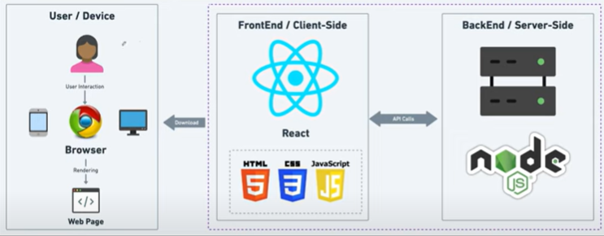

# INTRODUCTION

## 1. What is NodeJS?

- **NodeJS** is an open-source, cross-platform runtime environment for executing JavaScript code outside of a browser.
- It allows JavaScript to run on the server side.
- NodeJS runs on the **V8 engine** (the engine built into Chrome), which compiles JavaScript directly to native machine code.
    - V8 is written in C++ for speed.
- **NodeJS = V8 + Backend Features**
- Features an **event-driven**, **non-blocking I/O** model for efficiency.
- Allows using JavaScript on both the client and the server sides.
- Ideal for scalable network applications due to its architecture.

---

## 2. Features of NodeJS

- Designed to perform **non-blocking operations** by default, making it suitable for I/O-heavy tasks.
- Supports **TCP/UDP sockets**.
- Provides APIs to **read and write files directly**, which is not possible in browser environments for security reasons.
- Enables JavaScript to run on the server, handling HTTP requests, file operations, and other server-side functionalities.
- Code can be organized into reusable modules using `require()`.

> **Note**  
> In NodeJS, there is **no window object**, **no DOM manipulation**, **no BOM (Browser Object Model)**, and **no web-specific APIs** (like LocalStorage, sessionStorage, etc.).
---
## 3. JavaScript on Client Side
- Helps to interact with web Page.
- **Update Content:** Allows changes to the web page.
- Gets HTML, images,.. from the Server.
---
## 4. JavaScript on Server Side
- **Database Management:** stores, retrieves & manages data through operation like **CURD**(Create, Read, Update, Delete).
- **Authentication:** Verifies user identities to control access to the system.
- **Authorization:** Determines what authenticated user are allowed to do by managing permission and access controls.
- **Input Validation:** Check incoming data for correctness, completeness and security to prevent data entry errors.
- **Session Management:** Track user activity across various request to maintain state and manage user-specific settings.
- API Management 
- Error Handling
- Security Measures
- Data Encryption
- Logging and Monitoring
--- 
## 5. Server architechture

### Nodejs Server will
- Create server and listen to incoming requests.
- Validation, connect to database, Processing of data.
- Return Response.

---
## Client side vs Server Side
- The client sends a request, and the server responds.

