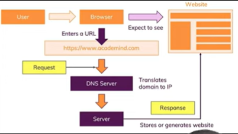

#  Node Server

## 1.How DNS Works?

- DNS:Domain Name Service
- User Types a Domain (www.google.com) into the browser.
- The browser sends a DNS query to resolve the domain into in IP address.
- **DNS Server:** Provides the correct ip address for the domain.
- Then the browser uses the IP to connect the web Server & loads the website.

**NOTE**
- **Root DNS:** Starting point of DNS resolution. It directs queries to the correct TDL server(.com, .in......).
- **TDL (Top Level Domain) DNS:** handel Queries for specific top level domain.
- **Authoritive DNS:** Connect the actual IP address of the domain and answer DNS queries.(like google.com)


---

## 2. How Web Works?



- Client Request Initiation--> DNS Resolution --> TCP Connection --> HTTP Request --> Server Processing --> HTTP Response --> Network transmission --> Client Recive Response --> Rendering.

--- 

## 3. What are the Protocols?

### Http (HyperText Tranfer Protocol):
- Facilated communication between a web browser and Server.
- Sends Data in plain text (no encryption).

### HTTPS (HyperText Tranfer Protocol Secure):
- Encrypts data for secure communiaction.
- Uses SSL/ TLS to encryption.

### TCP (Transmission Control Protocol):
- Ensure reliable, ordered data.
- Established a connection before data sending.

---

## 4. Node Core Modules

- **Built-in:** Core modules are included with node.js installation.
- Highly optimized for performance.
- eg. .fs, .http, .https, .path, .paths.os.........

---

## 5. Require Keyword
```js
const moduleNme = require('module');
```
- Import modules in Node js
- Modules are cached after the first call.

---

## 6. Creating first Node Server

```js
const http = require('http'); // import the core module http in a varible http

function requestListener(req, res) {
    console.log(req);
}

http.createServer(requestListener);
```
- Or 
```js
const http = require('http'); 

const Server = http.createServer((req, res) =>{
    console.log(req);
});

const PORT = 3000;
Server.listen(PORT, ()=>{
    console.log(`Server Running on Localhost:${PORT}`)
});
```
- Now run the code ( in terminal: node Name.js )
- then open localhost:3000 in your browser and check the terminal.
 ---
