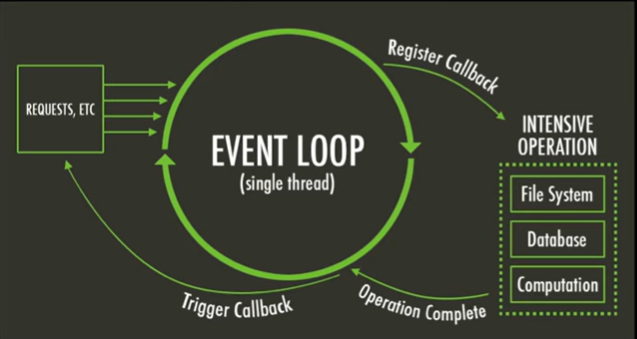

# EVENT LOOP

## Event Driven

---

## Single Threaded

 

## V8 vs libuv

### V8:
- Open source JavaScript engine by Google.
- Used in chrome and nodejs.
- Compiles JS to native machine code.
- Ensure high performence JS execution.

### libuv:
- Multi platfrom support library for Node.js.
- handles asynchronous I/O operation.
- Provides event-driven architechture.
- Manages file system, networking...

---

## Node Runtime
- An invoked function is added to the call stack. Once it returns a value, its popped off.
- db queries or other i/o operation do not block node.js because libuv API handles them.
- While libuv asynchronously handles i/o operations, Node js single thread keep running the code.
- callbacks of completed quries are moved to the event queue. If the call stack is empty, the event loop checks for callbacks and transfer the first.

---

## Event Loop

- timers -> pending callbacks -> idle, prepare -> poll -> check -> close callback-> timers.

- **timers:** this phase executes callbacks scheduled by setTimeout() and setInterval().
- **pending callbacks:** executes I/O callbacks deferred to the next loop iteration.
- **idle, prepare:** only used internally.
- **poll:** retrieve new I/O events; execute I/O related callbacks (almost all with the exception of close callbacks, the ones scheduled by timers, and setImmediate()); node will block here when appropriate.
- **check:** setImmediate() callbacks are invoked here.
- **close callbacks:** some close callbacks, e.g. socket.on('close', ...).

---

##

