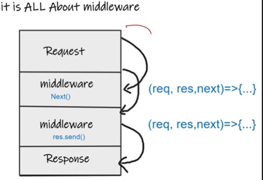
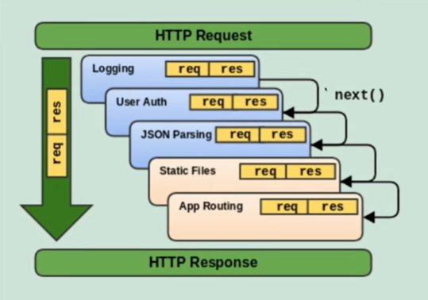

# ExpressJS

## What is Express.js
- It is minimal and flexible web application framework for Node.js.
- Ii provides a robust set of features for building single page, multi-page, and hybrid web application.
- It simplifies server side coading by providing a layer of fundamental web application feature.

---

## Need of Express.js
- It Simplifes Server Creation.
- Routing Management.
- Middleware Support.
- API Development.
- Community & Plugins.

---

## Insatlling Express.js:

```bash
npm install express
```
### Creating Server:
- app.js
```js
const express = require('express');

const app = express();

const PORT = 3000;
app.listen(PORT, () => {
    console.log(`Server Running on Localhost:${PORT}`);
});
```
---

## Adding Middleware

 

- we need to give perfect order of the middlewares.

```js 
const express = require('express');

const app = express();

app.use((req, res, next)=>{
    console.log("Came in First middleware", req.url, req.method);
    next();
})

app.use((req, res, next)=>{
    console.log("Came in second middleware", req.url, req.method);
})


const PORT = 3000;
app.listen(PORT, () => {
    console.log(`Server Running on Localhost:${PORT}`);
});
```
---

 

## Sending Response

```js

app.use((req, res, next)=>{
    console.log("Came in second middleware", req.url, req.method);
    res.send('<p>Welcome to middleware</p>');
})
```
- It will send response to the user in browser.

---

## Handling Routes

```js
app.use("/",(req, res, next)=>{
    console.log("Came in First middleware", req.url, req.method);
    next() // here no next is present because the next middleware is for /submit-details.
})

app.use("/submit-details",(req, res, next)=>{
    console.log("Came in second middleware", req.url, req.method);
     res.send('<p>Welcome to middleware</p>');
})
```
- Order Matters.
- can not call next() after send()
- "/ " matches everything 
- calling res.send() imlicitly calls res.end().

## Practice Set
- Create a new project.

1. Install nodemon and express.

2. Add two dummy middleware that logs request path and request method respectively.

3. Add a third middleware that returns a response.

4. Now add handling using two more middleware that handle path /, a request to /contact-us page.

5. Contact us should return a form with name and email as input fields that submits to /contact-us page als

6. Also handle POST incoming request to /contact-u path using a separate middleware.