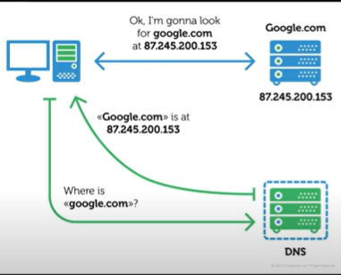
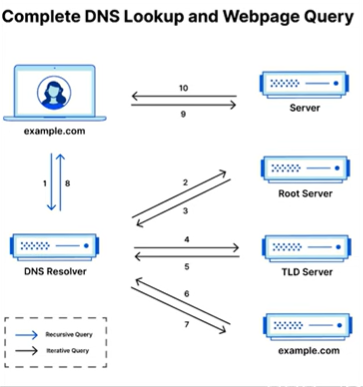
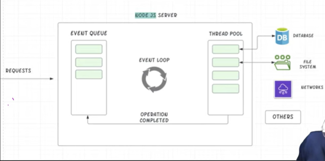

# Backend_Zero-to-Hero

**Playlist:** [YouTube](https://youtube.com/playlist?list=PL78RhpUUKSwdbr5GMk0GG5LpcWB-MIj2e&si=ssTx-0zRuo2yIt5z)

**Pre-requisites:** Understanding of JavaScript

---
# INTRODUCTION

## 1. What is NodeJS?

- **NodeJS** is an open-source, cross-platform runtime environment for executing JavaScript code outside of a browser.
- It allows JavaScript to run on the server side.
- NodeJS runs on the **V8 engine** (the engine built into Chrome), which compiles JavaScript directly to native machine code.
    - V8 is written in C++ for speed.
- **NodeJS = V8 + Backend Features**
- Features an **event-driven**, **non-blocking I/O** model for efficiency.
- Allows using JavaScript on both the client and the server sides.
- Ideal for scalable network applications due to its architecture.

---

## 2. Features of NodeJS

- Designed to perform **non-blocking operations** by default, making it suitable for I/O-heavy tasks.
- Supports **TCP/UDP sockets**.
- Provides APIs to **read and write files directly**, which is not possible in browser environments for security reasons.
- Enables JavaScript to run on the server, handling HTTP requests, file operations, and other server-side functionalities.
- Code can be organized into reusable modules using `require()`.


> **Note**  
> In NodeJS, there is **no window object**, **no DOM manipulation**, **no BOM (Browser Object Model)**, and **no web-specific APIs** (like LocalStorage, sessionStorage, etc.).
---
## 3. JavaScript on Client Side
- Helps to interact with web Page.
- **Update Content:** Allows changes to the web page.
- Gets HTML, images,.. from the Server.
---
## 4. JavaScript on Server Side
- **Database Management:** stores, retrieves & manages data through operation like **CURD**(Create, Read, Update, Delete).
- **Authentication:** Verifies user identities to control access to the system.
- **Authorization:** Determines what authenticated user are allowed to do by managing permission and access controls.
- **Input Validation:** Check incoming data for correctness, completeness and security to prevent data entry errors.
- **Session Management:** Track user activity across various request to maintain state and manage user-specific settings.
- API Management 
- Error Handling
- Security Measures
- Data Encryption
- Logging and Monitoring
--- 
## 5. Server architechture


### Nodejs Server will
- Create server and listen to incoming requests.
- Validation, connect to database, Processing of data.
- Return Response.

---
## Client side vs Server Side
- The client sends a request, and the server responds.


# INSTALLATION

## 1. Install Node.js

First, install [Node.js](https://nodejs.org/) on your system. Node.js comes with npm (Node Package Manager), which is required for installing React and its dependencies.

**Verify installation**

```bash
node --version
npm --version
npx --version
```

If all of the above commands return a version number, your installation is correct.

---

## 2. Executing JS File Using NOde
- create a js file:
```js
console.log("hello");
```
To run the code open terminal :

```bash
node name.js
```
- You will get output: Hello

---

## 3. REPL
- R(Read) E(Eval) P(Print) L(Loop).
- Execute JS Code interactively.
- Ideal for testing, debugging..

### Executing Code via REPL
- Open terminal
```bash
node
```
- After this you can execute js code 
- To exit press ctrl+c twice.

---

#  Node Server

## 1.How DNS Works?

- **DNS:**Domain Name Service
- User Types a Domain (www.google.com) into the browser.
- The browser sends a DNS query to resolve the domain into in IP address.
- **DNS Server:** Provides the correct ip address for the domain.
- Then the browser uses the IP to connect the web Server & loads the website.

**NOTE**
- **Root DNS:** Starting point of DNS resolution. It directs queries to the correct TDL server(.com, .in......).
- **TDL (Top Level Domain) DNS:** handel Queries for specific top level domain.
- **Authoritive DNS:** Connect the actual IP address of the domain and answer DNS queries.(like google.com)



---

## 2. How Web Works?


- Client Request Initiation--> DNS Resolution --> TCP Connection --> HTTP Request --> Server Processing --> HTTP Response --> Network transmission --> Client Recive Response --> Rendering.

--- 

## 3. What are the Protocols?

### Http (HyperText Tranfer Protocol):
- Facilated communication between a web browser and Server.
- Sends Data in plain text (no encryption).

### HTTPS (HyperText Tranfer Protocol Secure):
- Encrypts data for secure communiaction.
- Uses SSL/ TLS to encryption.

### TCP (Transmission Control Protocol):
- Ensure reliable, ordered data.
- Established a connection before data sending.

---

## 4. Node Core Modules

- **Built-in:** Core modules are included with node.js installation.
- Highly optimized for performance.
- eg. .fs, .http, .https, .path, .paths.os.........

---

## 5. Require Keyword
```js
const moduleNme = require('module');
```
- Import modules in Node js
- Modules are cached after the first call.

---

## 6. Creating first Node Server

```js
const http = require('http'); // import the core module http in a varible http

function requestListener(req, res) {
    console.log(req);
}

http.createServer(requestListener);
```
- Or 
```js
const http = require('http'); 

const Server = http.createServer((req, res) =>{
    console.log(req);
});

const PORT = 3000;
Server.listen(PORT, ()=>{
    console.log(`Server Running on Localhost:${PORT}`)
});
```
- Now run the code ( in terminal: node Name.js )
- then open localhost:3000 in your browser and check the terminal.
 ---

 # Request & Response

## 1. Node lifecycle & NodeLoop



---
## 2. How to exit event loop

```js
const http = require('http'); 
const Server = http.createServer((req, res) =>{
    console.log(req);
    process.exit(); // Stops the Event Loop
});

const PORT = 3000;
Server.listen(PORT, ()=>{
    console.log(`Server Running on Localhost:${PORT}`)
});
```
---

## 3. Request object

```js
const http = require('http'); 
const Server = http.createServer((req, res) =>{
    console.log(req.url, req.method, req.headers); // request objects
});

const PORT = 3000;
Server.listen(PORT, ()=>{
    console.log(`Server Running on Localhost:${PORT}`)
});
```
---

## 4. Sending Response

```js
const http = require('http'); 
const Server = http.createServer((req, res) =>{
    console.log(req.url, req.method, req.headers);
    res.setHeader('Content-Type', 'text/html');
    res.write('<html>');
    res.write('<head><title>Complete Backend</title></head>');
    res.write('<body><h1>Complete Backend</h1></body>');
    res.write('</html>');
    res.end();
});

const PORT = 3000;
Server.listen(PORT, ()=>{
    console.log(`Server Running on Localhost:${PORT}`)
});
```
---

## 5. 